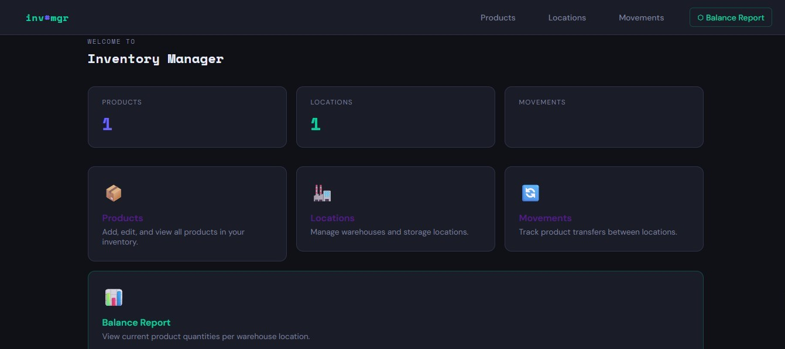

# Inventory Management Web App

A Flask-based inventory management system with product tracking, warehouse locations, and movement history

## Features

- Add / Edit / View Products
- Add / Edit / View Locations
- Add / Edit / View Product Movements (with from/to location)
- Balance Report - current quantity per product per location

## Implementation

### First Implemented the Dashboard

I started by implementing the Dashboard first, focusing on the frontend using HTML and Jinja templating.
The Dashboard serves as the central hub displaying:

- Count of Products, Locations, and Movements stored in the database
- Navigation bar for accessing Products, Locations, Movements, and Balance Report pages
- Navigation cards for quick access to each module.

### Second Implemented the Product Module

After the implementation of the Dashboard, I started implementing the Product module. It renders the same UI and displays the list of products:

- Displays a list of all products stored in the database
- Provides an Add button to create new products, which navigates to the Product Form page
- Captures the Product ID during creation for database storage
- Enables editing and deleting of existing products in the list

Product module interface showing product list with add, edit, and delete functionality

Product form interface with input fields for product ID, along with Save and Cancel buttons

### Third Implemented the Location Module

After implementation of the Product module, I started implementing the Location module. This module manages warehouse locations where inventory is stored. The UI includes:

- Displays a list of all warehouse locations stored in the database
- Provides an Add button to create new locations, which navigates to the Location Form page
- Captures the Location ID and details during creation for database storage
- Enables editing and deleting of existing locations in the list

Location module interface showing warehouse locations list with add, edit, and delete functionality

Location form interface with input fields for location ID and details, along with Save and Cancel buttons

### Fourth Implemented the Movements Module

After implementation of the Location module, I started implementing the Movements module. This module tracks product movements between locations and displays movement history for each product. The UI shows:

- List of all product movements with from/to locations and quantities
- Add button to record new product movements
- Edit and delete functionality for existing movements
- Movement details including product, source location, destination location, and timestamp
Movement module interface showing product movements list with add, edit, and delete functionality

Movement form interface with input fields for product selection, source location, destination location, and quantity, along with Save and Cancel buttons

